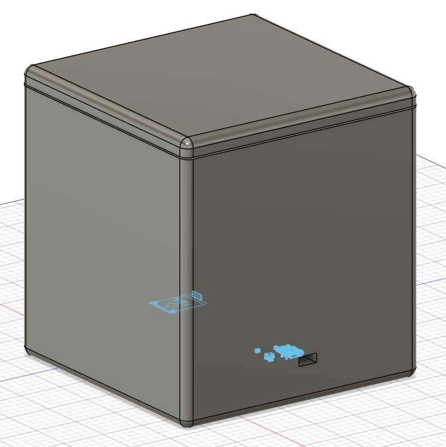
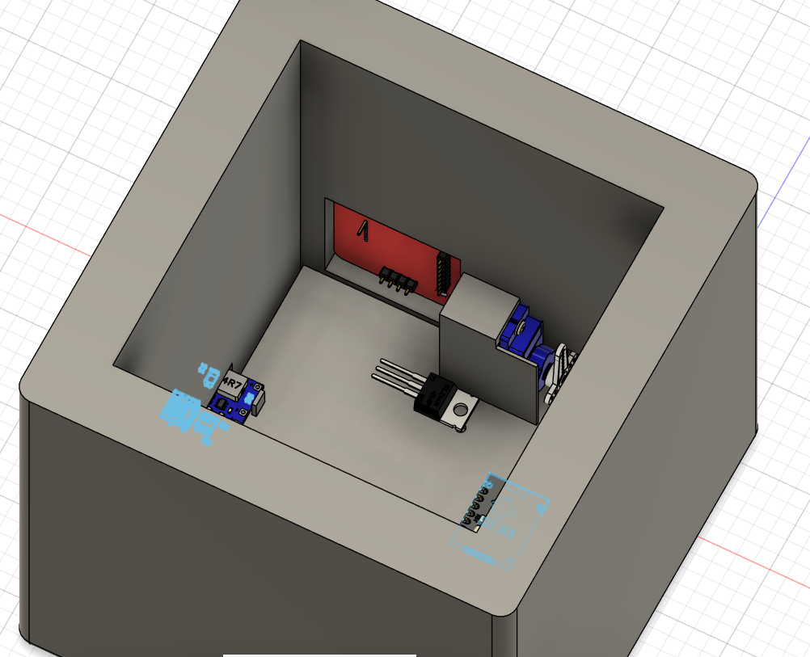

# Secret-Box  

  

**Secret-Box is a small box that unlocks with an RFID card. Tap the chip near the reader and a servo unlocks the lid.**  

It runs on a 3.7V battery so it doesn't need to be plugged in, and a MOSFET cuts power to the servo completely when it's not doing anything, which keeps the battery from draining. The whole thing is built around an ESP32-C3 SuperMini and fits inside a 3D printed enclosure held together with heatset inserts and screws.  

  

## How It Works  

The PN532 RFID reader constantly listens for a card. When it sees an authorized one, the ESP32 tells the MOSFET to give power to the servo, which then rotates and unlocks the lid. When it's done, the MOSFET cuts the servo's power again so it's not wasting any electricity sitting there. The power module handles charging the battery and makes sure everything gets a clean 5V. Has 3.7V battery for function without charging.  

## Bill of Materials  

Click to see BOM

| Name | Purpose | Qty | Total (USD) | Link | Distributor |
|------|---------|-----|-------------|------|-------------|
| Jumper wires (small kit) | Connect all components, kit has 20x M-F, 20x M-M, 20x F-F | 1 | $3.62 | [Link](https://www.aliexpress.com/item/4000203371860.html) | Aliexpress |
| M2x4mm screws | To secure some parts even more | 1 | $2.04 | [Link](https://www.aliexpress.com/item/32810852732.html) | Aliexpress |
| M2x3mm screws | Go into heatset inserts to secure everything | 1 | $1.95 | [Link](https://www.aliexpress.com/item/32810852732.html) | Aliexpress |
| M2xL2xOD3 Heatset Inserts | Secures everything with screws and a soldering iron | 1 | $3.11 | [Link](https://www.aliexpress.com/item/1005006071488810.html) | Aliexpress |
| ESP32-C3 SuperMini | Brain of everything, controls movement of servos, RFID reader, MOSFET | 1 | $2.94 | [Link](https://www.aliexpress.com/item/1005007496189056.html) | Aliexpress |
| IRLZ44N (MOSFET) | Completely cuts power to servos so they don't use any electricity when not in use | 1 | $1.77 | [Link](https://www.aliexpress.com/item/1005008120572312.html) | Aliexpress |
| PN532 module set (RFID reader) | Reads RFID cards, small kit that has the chip and reader | 1 | $4.07 | [Link](https://www.aliexpress.com/item/1005007182056113.html) | Aliexpress |
| Servo motor | Locks and unlocks the lid | 1 | $4.55 | [Link](https://www.aliexpress.com/item/1005007257546981.html) | Aliexpress |
| 3.7V Battery | Lets the whole project run without needing to be plugged in | 1 | $8.15 | [Link](https://www.aliexpress.com/item/1005007257546981.html) | Aliexpress |
| Power module | Recharges the battery and gives a stable 5V output | 1 | $1.26 | [Link](https://www.aliexpress.com/item/1005005656423941.html) | Aliexpress |

**Total: $33.46**  
> ⚠️ Doesn't include shipping  

## For the Future  

Click to expand

Things I want to add later but haven't gotten to yet:  

- **Multiple authorized cards** — right now only one card works, would be nice to support a few and maybe different cards open different sections  
- **Wrong card feedback** — a buzzer or LED that reacts when an unauthorized card is scanned  
- **NFC** — NFC would be more secure  

  
License

  
## MIT License  

**Copyright (c) 2026 TomasD-git**  

Permission is hereby granted, free of charge, to any person obtaining a copy
of this software and associated documentation files (the "Software"), to deal
in the Software without restriction, including without limitation the rights
to use, copy, modify, merge, publish, distribute, sublicense, and/or sell
copies of the Software, and to permit persons to whom the Software is
furnished to do so, subject to the following conditions:

The above copyright notice and this permission notice shall be included in all
copies or substantial portions of the Software.

THE SOFTWARE IS PROVIDED "AS IS", WITHOUT WARRANTY OF ANY KIND, EXPRESS OR
IMPLIED, INCLUDING BUT NOT LIMITED TO THE WARRANTIES OF MERCHANTABILITY,
FITNESS FOR A PARTICULAR PURPOSE AND NONINFRINGEMENT. IN NO EVENT SHALL THE
AUTHORS OR COPYRIGHT HOLDERS BE LIABLE FOR ANY CLAIM, DAMAGES OR OTHER
LIABILITY, WHETHER IN AN ACTION OF CONTRACT, TORT OR OTHERWISE, ARISING FROM,
OUT OF OR IN CONNECTION WITH THE SOFTWARE OR THE USE OR OTHER DEALINGS IN THE
SOFTWARE.

